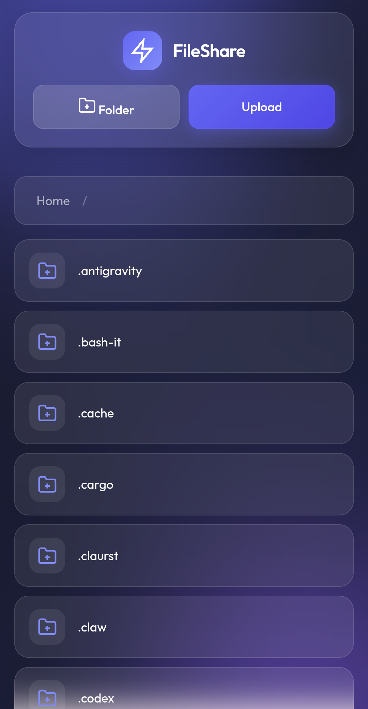
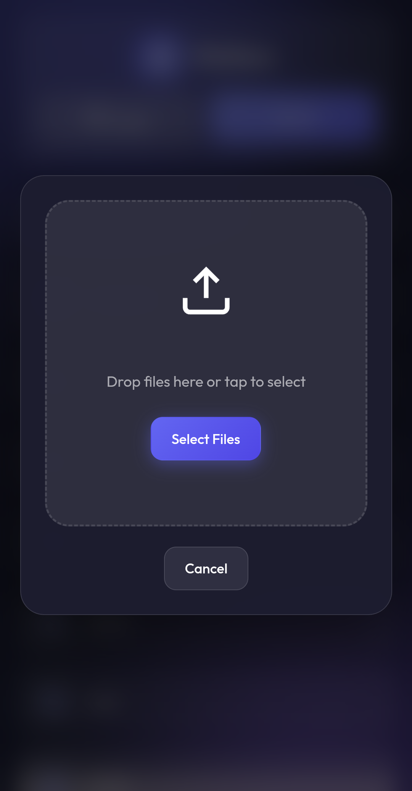
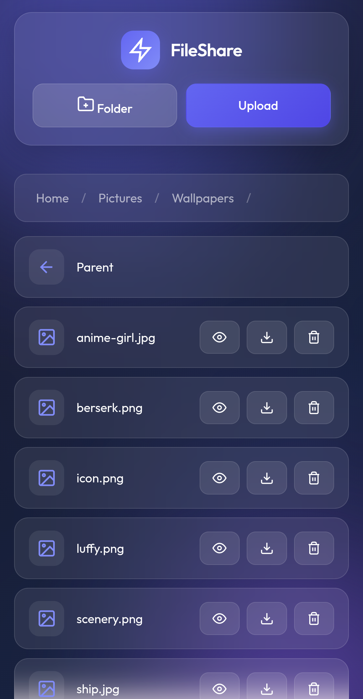
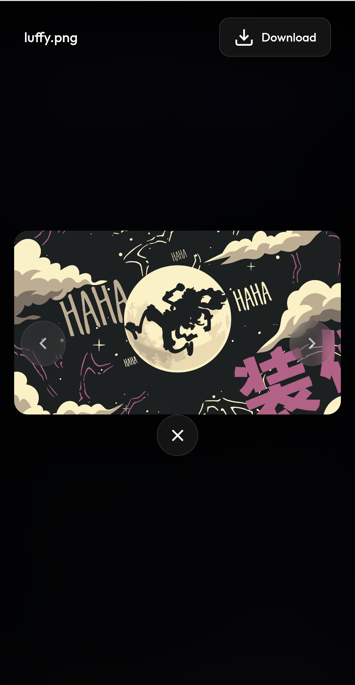

# FileShare 🌐

A simple, elegant file sharing web app that lets you access your laptop's files from your phone via Tailscale.

## Screenshots

<p float="left">
  
  
</p>
<p float="left">
  
  
</p>

## Features

- 📁 **Browse Files** — Navigate your entire home directory from browser
- 📤 **Upload** — Send files from phone to laptop
- ⬇️ **Download** — Get files from laptop to phone
- 👁️ **Preview** — View images and videos inline
- 🗑️ **Delete** — Remove files/folders
- ➕ **Create Folders** — Organize your files
- 🔐 **Secure** — Only accessible via Tailscale (not exposed to internet)
- ✨ **Modern UI** — Beautiful glassmorphism design with smooth animations

## Requirements

- Python 3.8+
- Tailscale account
- A device to run the server (laptop/PC)

## Quick Setup

### 1. Clone & Setup

```bash
# Clone or download this project
cd FileShare

# Create virtual environment
python3 -m venv venv

# Activate it
source venv/bin/activate  # Linux/Mac
# or
venv\Scripts\activate  # Windows

# Install dependencies
pip install -r requirements.txt
```

### 2. Install & Setup Tailscale

```bash
# Install Tailscale
curl -fsSL https://tailscale.com/install.sh | sh

# Login
sudo tailscale up

# Set hostname (optional)
sudo tailscale set --hostname=device
```

### 3. Start the Server

```bash
# Start server (binds to all interfaces for phone access)
source venv/bin/activate && python manage.py runserver 0.0.0.0:8000
```

### 4. Access From Phone

1. Install Tailscale app on your phone
2. Login with the same account
3. Open browser and go to:
   ```
   http:// YOUR_LAPTOP_IP :8000
   ```

Get your laptop IP with: `hostname -I`

## Configuration

### Change Shared Folder

By default, the app shares your entire `/home/username` directory.

To change this, edit `files/views.py`:

```python
# Change this line
SHARE_ROOT = Path('/home/shahzan')
# To your desired folder
SHARE_ROOT = Path('/home/username/YourFolder')
```

## Project Structure

```
FileShare/
├── start.sh            # Quick start script (deprecated)
├── manage.py          # Django management script
├── requirements.txt  # Python dependencies
├── README.md         # Documentation
├── .gitignore       # Git ignore rules
├── LICENSE          # MIT License
├── AGENTS.md        # Agent instructions
├── sharecore/       # Django project settings
│   ├── settings.py  # App configuration
│   └── urls.py    # URL routing
├── files/           # Main app
│   ├── views.py   # File operations
│   ├── urls.py   # App URLs
│   └── templates/
│       └── files/
│           └── index.html  # Frontend UI
└── screenshots/    # App screenshots
```

## Security Notes

- 🔒 The server binds to all interfaces — access controlled by Tailscale
- 📱 Only devices connected to your Tailscale network can access
- 🛡️ Files are protected by Tailscale's encryption

## Troubleshooting

### Can't access the URL?
- Make sure Tailscale is running on both laptop and phone
- Check the hostname: `tailscale status`
- Try using the IP instead: `http://YOUR_IP:8000`

### Server won't start?
- Make sure port 8000 is not in use
- Check Tailscale is connected: `tailscale status`

### Can't see files?
- Check the SHARE_ROOT path in `files/views.py`
- Make sure you have permission to read the folder

## Credits

Created by: Abdulla Shahzan