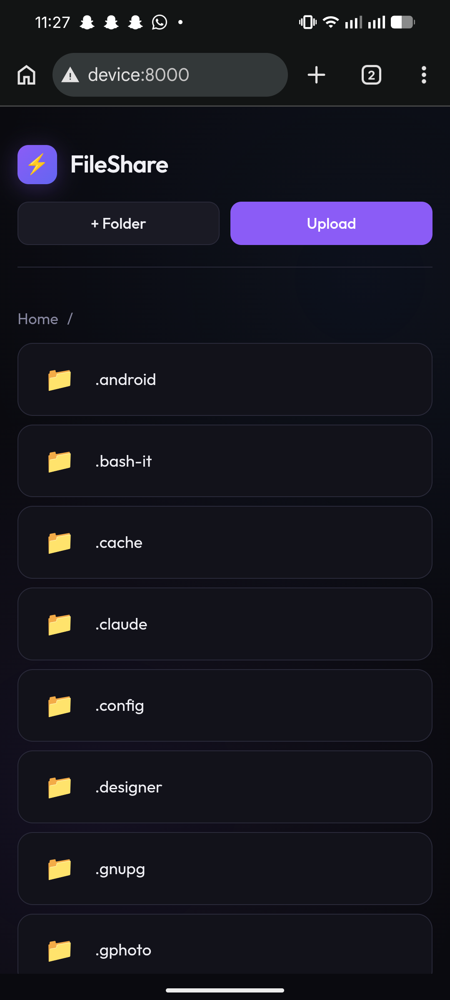
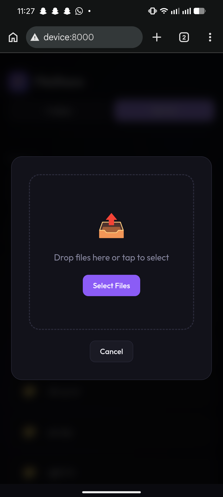
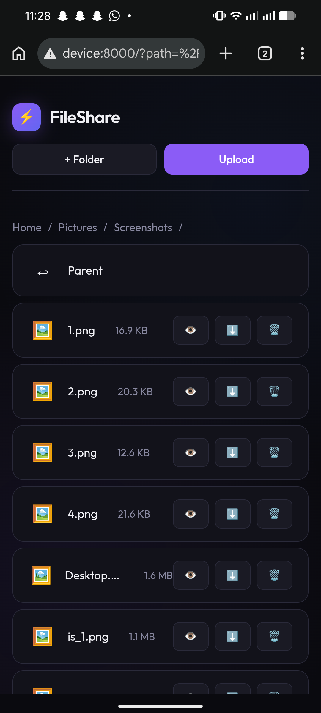
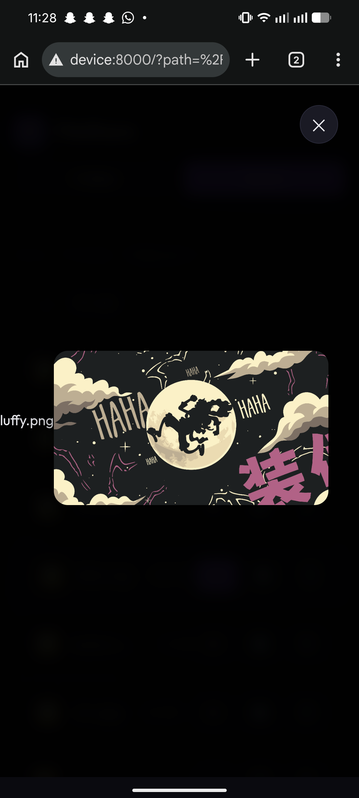
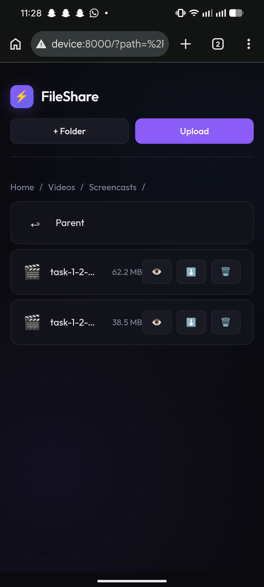
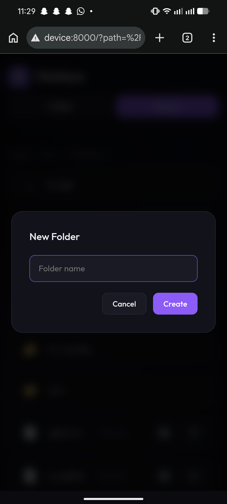

# FileShare 🌐

A simple, elegant file sharing web app that lets you access your laptop's files from your phone via Tailscale.

## Screenshots

<p float="left">
  
  
  
</p>
<p float="left">
  
  
  
</p>

## Features

- 📁 **Browse Files** — Navigate your entire home directory from browser
- 📤 **Upload** — Send files from phone to laptop
- ⬇️ **Download** — Get files from laptop to phone
- 👁️ **Preview** — View images and videos inline
- 🗑️ **Delete** — Remove files/folders
- ➕ **Create Folders** — Organize your files
- 🔐 **Secure** — Only accessible via Tailscale (not exposed to internet)
- 🌙 **Dark Mode** — Beautiful minimal dark UI

## Requirements

- Python 3.8+
- Tailscale account
- A device to run the server (laptop/PC)

## Quick Setup

### 1. Clone & Setup

```bash
# Clone or download this project
cd FileShare

# Create virtual environment
python3 -m venv venv

# Activate it
source venv/bin/activate  # Linux/Mac
# or
venv\Scripts\activate  # Windows

# Install dependencies
pip install -r requirements.txt

# Run migrations
python manage.py migrate
```

### 2. Install & Setup Tailscale

```bash
# Install Tailscale
curl -fsSL https://tailscale.com/install.sh | sh

# Login
sudo tailscale up

# Set hostname (optional)
sudo tailscale set --hostname=device
```

### 3. Start the Server (Recommended)

Use the startup script for a seamless experience:

```bash
# Make the script executable
chmod +x start.sh

# Run the server (starts Tailscale automatically, stops everything on Ctrl+C)
./start.sh
```

This script will:
- Automatically start Tailscale
- Connect and get your Tailscale IP
- Launch the Django server
- Cleanly shut down Tailscale when you press Ctrl+C

### Alternative: Manual Start

```bash
# Get your Tailscale IP
tailscale ip -4

# Start server on Tailscale IP
python manage.py runserver 100.x.x.x:8000
```

Replace `100.x.x.x` with your Tailscale IP.

### 4. Access From Phone

1. Install Tailscale app on your phone
2. Login with the same account
3. Open browser and go to:
   ```
   http://device:8000
   ```
   or use your Tailscale IP:
   ```
   http://100.x.x.x:8000
   ```

## Configuration

### Change Shared Folder

By default, the app shares your entire `/home/username` directory.

To change this, edit `files/views.py`:

```python
# Change this line
SHARE_ROOT = Path('/home/shahzan')
# To your desired folder
SHARE_ROOT = Path('/home/username/YourFolder')
```

### Change Port

Edit the runserver command:

```bash
python manage.py runserver 100.x.x.x:9000
```

## Project Structure

```
FileShare/
├── start.sh            # Quick start script (recommended)
├── manage.py          # Django management script
├── requirements.txt   # Python dependencies
├── README.md          # Documentation
├── .gitignore        # Git ignore rules
├── LICENSE           # MIT License
├── sharecore/        # Django project settings
│   ├── settings.py   # App configuration
│   └── urls.py       # URL routing
├── files/            # Main app
│   ├── views.py      # File operations
│   ├── urls.py       # App URLs
│   └── templates/
│       └── files/
│           └── index.html  # Frontend UI
└── screenshots/      # App screenshots
```

## Available Commands

```bash
# Start server
python manage.py runserver 100.x.x.x:8000

# Create migrations (if you modify models)
python makemigrations
python migrate

# Apply migrations
python migrate
```

## Security Notes

- 🔒 The server binds to your Tailscale IP only — not exposed to public internet
- 📱 Only devices connected to your Tailscale network can access
- 🛡️ Files are protected by Tailscale's encryption
- ⚠️ No authentication by default — add if needed for extra security

## Troubleshooting

### Can't access the URL?
- Make sure Tailscale is running on both laptop and phone
- Check the hostname: `tailscale status`
- Try using the IP instead: `http://100.x.x.x:8000`

### Server won't start?
- Make sure port 8000 is not in use
- Check Tailscale is connected: `tailscale status`

### Can't see files?
- Check the SHARE_ROOT path in `files/views.py`
- Make sure you have permission to read the folder

## Credits

Created by: Abdulla Shahzan
